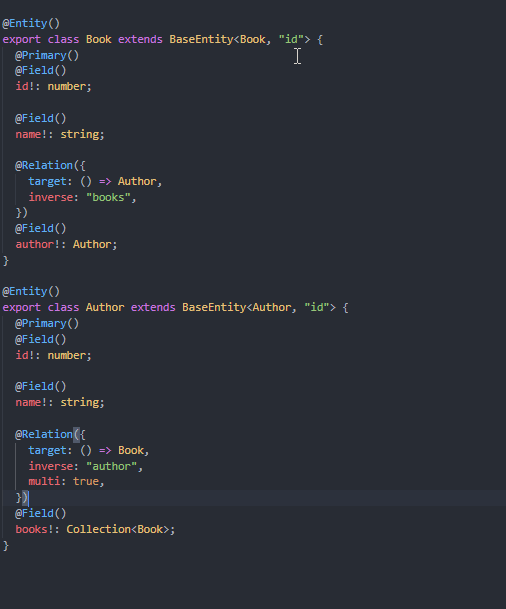
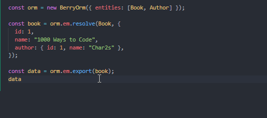

# Introduction

Berry ORM is a lightweight object relation mapper with **_❗SUPER AWESOME TYPINGS❗_**.

> **The types currently only apply to TypeScript 4.3 and 4.4.**

```sh
npm i berry-orm
```

There are much efforts spent on types, which is the key feature of this project, to show how strict the types can be in an ORM and how convenient it can be to work with these super awesome types!

## Possible Scenarios

- Manage relational state in a web application
- Keep large amounts of relational data in IndexedDB
- Store relational data in simple files like "data.json"

## Examples

### Defining Entities

<details>

```ts
@Entity()
class Book extends BaseEntity<Book, "id"> {
  @Primary()
  @Field()
  id!: number;

  @Field()
  name!: string;

  @Relation({
    target: () => Author,
    inverse: "books",
  })
  @Field()
  author!: Author;
}

@Entity()
class Author extends BaseEntity<Author, "id"> {
  @Primary()
  @Field()
  id!: number;

  @Field()
  name!: string;

  @Relation({
    target: () => Book,
    inverse: "author",
    multi: true,
  })
  @Field()
  books!: Collection<Book>;
}
```

</details>



### Resolving Data

```ts
const orm = new BerryOrm({ entities: [Book, Author] });

const book1 = orm.em.resolve(Book, {
  id: 1,
  name: "1000 Ways to Code",
  author: 1,
});

book1[RESOLVED]; // true
book1.author[RESOLVED]; // false

const book2 = orm.em.resolve(Book, {
  id: 2,
  name: "2000 Ways to Code",
  author: { id: 1, name: "Char2s" },
});

book2[RESOLVED]; // true
book2.author[RESOLVED]; // true

book1.author == book2.author; // true
```

### Exporting Entities

<details>

```ts
const orm = new BerryOrm({ entities: [Book, Author] });

const book = orm.em.resolve(Book, {
  id: 1,
  name: "1000 Ways to Code",
  author: { id: 1, name: "Char2s" },
});

const data = orm.em.export(book, { author: { books: { author: true } } });
data.author.books[0].author.
```

</details>


