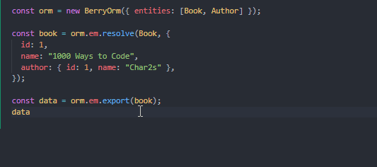

# 导出实体

实体也可以通过 `orm.em.export()` 转换回普通数据对象。

## 基本

主键和公共字段在导出的普通字段中的值将直接从实体中复制，关系将默认使用主键来表示。

```ts
const book = orm.em.resolve(Book, {
  id: 1,
  name: "Book",
  作者。{ id: 1, name: "Char2s" },
});

const data = orm.em.export(book);
data.id; // "id
data.name; // "Book"
data.author; // 1
```

## 扩展

关系在导出的对象中默认使用主键表示，但我们可以通过第二个参数 `expansions` 来指定哪些关系要被扩展为嵌套的普通数据对象。

```ts
const data = orm.em.export(user, {
  profile: true,
  friends: { profile: true },
});
```

```ts
typeof data.profile; // "object"
data.friends.forEach((friend) => {
  typeof friend; // "object"
  typeof friend.profile; // "object"
});
```

::: tip

`orm.em.export()` 具备严格的类型。

- 返回值类型是动态生成的。
- 如果不合法的值被传递给 `expansions`，将会出现类型错误。不过由于 TypeScript 的限制，不支持自动补全。



:::

::: warning

在 `expansions` 中指定的关系中不能有[骨架实体](./resolving-data.html#skeleton-entities)，否则将抛出错误。

:::
