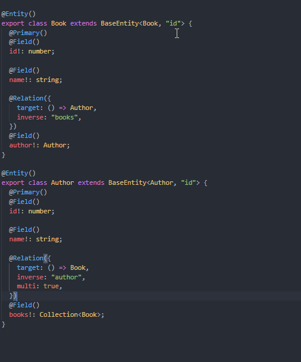

# 简介

一个具备 **_❗ 超 棒 类 型 ❗_** 的轻量级对象关系映射器。

```sh
npm i berry-orm
```

我们在类型上花费了大量的精力，用以揭示一个 ORM 中的类型能严格到什么程度，以及使用这些超棒的类型有多令人愉悦，这也是这个项目的最大特色。

> **需要: TypeScript 4.1/4.2/4.3/4.4/4.5**

## 可能的使用情景

- 在 Web 应用中管理关系状态
- 在 IndexedDB 中保存大量关系数据
- 在类似 "data.json" 的简单文件中保存关系数据

## 示例

### 定义实体

<details>

```ts
@Entity()
class Book extends BaseEntity<Book, "id"> {
  @Primary()
  @Field()
  id!: number;

  @Field()
  name!: string;

  @Relation({
    target: () => Author,
    inverse: "books",
  })
  @Field()
  author!: Author;
}

@Entity()
class Author extends BaseEntity<Author, "id"> {
  @Primary()
  @Field()
  id!: number;

  @Field()
  name!: string;

  @Relation({
    target: () => Book,
    inverse: "author",
    multi: true,
  })
  @Field()
  books!: Collection<Book>;
}
```

</details>



### 解析数据

```ts
const orm = new BerryOrm({ entities: [Book, Author] });

const book1 = orm.em.resolve(Book, {
  id: 1,
  name: "1000 Ways to Code",
  author: 1,
});

book1[RESOLVED]; // true
book1.author[RESOLVED]; // false

const book2 = orm.em.resolve(Book, {
  id: 2,
  name: "2000 Ways to Code",
  author: { id: 1, name: "Char2s" },
});

book2[RESOLVED]; // true
book2.author[RESOLVED]; // true

book1.author == book2.author; // true
```

### 导出实体

<details>

```ts
const orm = new BerryOrm({ entities: [Book, Author] });

const book = orm.em.resolve(Book, {
  id: 1,
  name: "1000 Ways to Code",
  author: { id: 1, name: "Char2s" },
});

const data = orm.em.export(book, { author: { books: { author: true } } });
data.author.books[0].author.
```

</details>


